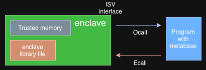
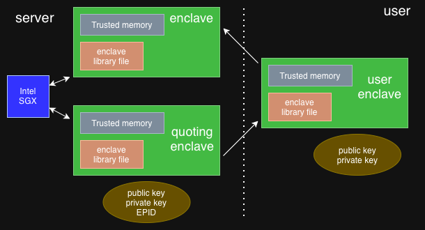

# 10-10-Project
Enclave (TEE), Attestation / Sealing, Anonymized Location Comparison
* **Enclave (Trusted Execution Environment, TEE)**: A protected region (TCB, Trusted Computing Base) created within the CPU to safeguard sensitive code/data from external attacks (e.g., OS, malicious software).

* **Communication**: Secure communication between the Enclave interior and the exterior (Host OS) is achieved through E-Call (External → Internal) and O-Call (Internal → External).

## Key Enclave Functions
* **Attestation**: A mechanism to verify the trustworthiness of another Enclave/platform (Local or Remote).

* **Sealing**: The ability to encrypt/decrypt data for storage, ensuring it can only be accessed by the Enclave itself.

## Application and Tools
* **Usage Example**: An application for comparing user location data by anonymizing it and safely comparing it with confirmed patient routes inside the Enclave, ensuring no personal data leakage.
* **Graphene/Gramine**: An OS designed to automate the development of Enclave-enabled applications.

## Code Explaination
This document describes the core security logic of the **COVID-19 patient movement tracking program**, which centers on the interaction between the Quoting Enclave running on the user device and the Host Enclave running on the server.

* **GOAL**: It anonymizes and segments the user's movement information to prevent personal identification, and checks for movement overlap with the confirmed patient database faster than with homomorphic encryption.

* **Client-to-Server Communication** The User App activates the Quoting Enclave and requests an E-Call, providing the user's movement data to the Host Enclave on the server.
* **Host Enclave Attestation and Sealing** The server app compares the key information with the received Quote and activates the Host Enclave through the Attestation process.
* **Data Partitioning and Anonymization** Inside the Host Enclave, the key information required to activate the Quoting Enclave, the enclave information, and the result destination information are sealed and temporarily stored.
